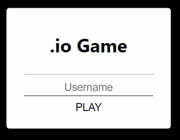
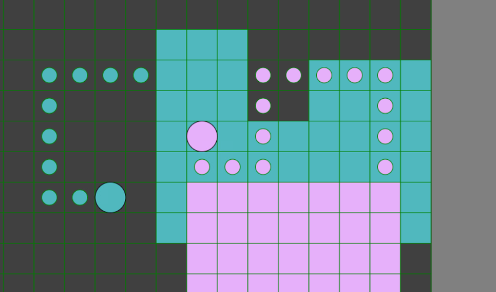

# Jeux de tuiles

## Participant :

  * Armand Prevot
  * Arthur Fontaine
  * Steven Bouche

## Development

Pour le client web :

```bash
$ cd .\current\client\ 
$ npm install
$ npm start
```

Pour le serveur :

```bash
$ cd .\current\client\src\server\ 
$ npm install
$ npm start
```
## Game

Le but du jeux est d'obtenir la plus grande air possible.

Si le joueur passe sur son propre chemin, game over.
Si le joueur passe sur le chemin d'un autre joueur, il l'élimine. 

Menu d'accueil :



Jeux :




